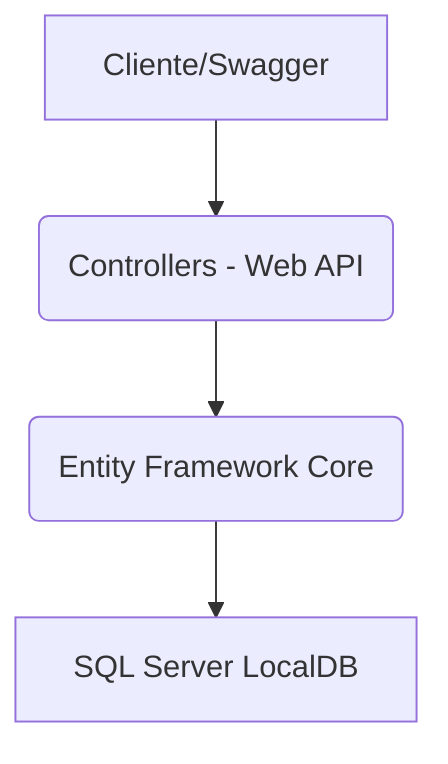
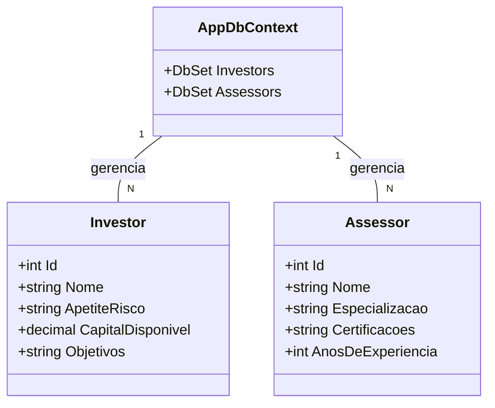

# MatchInvest - Web API: Conectando Investidores a Especialistas

Este projeto de API RESTful foi desenvolvido para a **Sprint 4** da disciplina de C# (ASP.NET Core Web API), tendo como base a solução **MatchInvest**. O objetivo principal é demonstrar a implementação de um back-end moderno utilizando Entity Framework Core (EF Core), CRUD completo e consultas LINQ.

---

## 🛠️ Requisitos da Sprint Cumpridos

Esta aplicação atende a todos os requisitos da entrega de C# (Sprint 4):

* **ASP.NET Core Web API e Entity Framework com CRUD completo**: O projeto utiliza EF Core para gerenciar o banco de dados e implementa todos os verbos HTTP (GET, POST, PUT, DELETE) para as entidades `Investor` e `Assessor`.
* **Pesquisas com LINQ**: A API possui um endpoint de pesquisa que utiliza consultas LINQ para filtrar assessores.
* **Documentação do Projeto (Swagger/OpenAPI)**: A documentação técnica completa é gerada automaticamente pelo Swagger.
* **Métodos e funções estruturadas/código limpo**: O código é organizado em Controllers, Models e Data, seguindo a arquitetura em camadas e as boas práticas do ASP.NET Core.

---

## 🔗 Tecnologias Utilizadas

* **Linguagem:** C#
* **Plataforma:** ASP.NET Core Web API
* **ORM:** Entity Framework Core (EF Core)
* **Banco de Dados:** SQL Server LocalDB
* **Documentação:** Swagger / OpenAPI

---

## 🏗️ Arquitetura e Diagramas

O projeto segue a arquitetura de três camadas (Models, Data, Controllers), essencial para a manutenção e legibilidade.

### Diagrama de Arquitetura de Camadas



### Diagrama UML de Entidades (Classes Principais)



## ▶️ Como Rodar e Testar a API

### 1. Configuração do Banco de Dados

1.  Instale os pacotes NuGet de migração do Entity Framework (`Microsoft.EntityFrameworkCore.Design`).
2.  Abra o **Console do Gerenciador de Pacotes** no Visual Studio (Ferramentas > NuGet Package Manager > Package Manager Console) e execute o comando para criar o banco de dados:
    ```powershell
    Update-Database
    ```

### 2. Executar e Acessar a Documentação

1.  Execute o projeto (**F5** no Visual Studio ou `dotnet run` no terminal).
2.  O navegador abrirá automaticamente a página de documentação do Swagger (ex: `http://localhost:XXXX/swagger`).

### 3. Endpoints Principais (Testes)

Use a interface do Swagger para validar as funcionalidades de CRUD e LINQ:

| Recurso | Verbo | Rota | Função e Exemplo |
| :--- | :--- | :--- | :--- |
| **Investidores** | `POST` | `/api/investors` | Cria um novo Investidor (CRUD). |
| **Assessores** | `GET` | `/api/assessors` | Lista todos os Assessores (CRUD). |
| **Pesquisa LINQ**| `GET` | `/api/assessors/search` | Filtra por especialização. Ex: `search?especializacao=renda fixa` |
| **CRUD** | `PUT` | `/api/investors/{id}` | Atualiza o perfil de um Investidor. |
| **CRUD** | `DELETE` | `/api/assessors/{id}` | Exclui um Assessor. |

### 👥 Membros do Grupo
* **Enzo Luiz Goulart - RM99666**
* **Gustavo Henrique Santos Bonfim - RM98864**
* **Kayky Paschoal Ribeiro - RM99929**
* **Lucas Yuji Farias Umada - RM99757**
* **Natan Eguchi dos Santos - RM98720**
